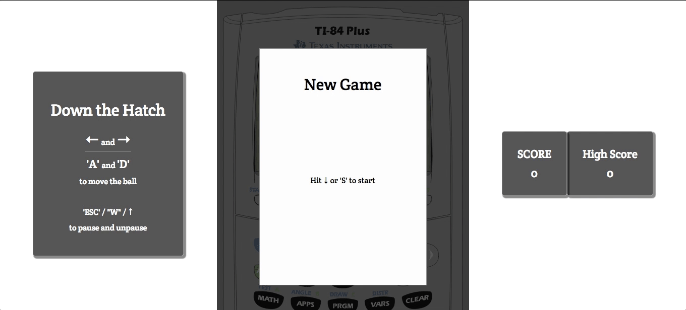

## Down the Hatch
[live](http://matthew-moon.com/down-the-hatch)

Down the Hatch is a Javascript recreation of the Texas Instruments graphing calculator classic, *Falldown*, which itself is possibly an homage to *Fall Down 2600* by Atari.

### *Instructions*
The goal is to simply move left or right and drop through a series of breaks that appear on rising platforms.  The frequency of the rising walls increase over time.  Avoid hitting the ceiling for as long as possible.

### *Build*
The entirety of the project was built with ES6 Vanilla flavored JavaScript, `easel.js` library from the [CreateJS](http://createjs.com/) suite, `keymaster.js` compliments of [madrobby](https://github.com/madrobby/keymaster), CSS3 and HTML5.

### *v2 tbd*
- Mobile: The next logical step would be to bake-in a mobile-intuitive version allowing touch/slide for navigation as well as taps for pause and restart.
- Advanced difficulty: leave behind a 'brick' path disallowing the option to go back once started in a particular direction.
- Game Type Option: Allow wrap-around on platforms as toggle before game start, letting you leave from one end and enter the opposite.
