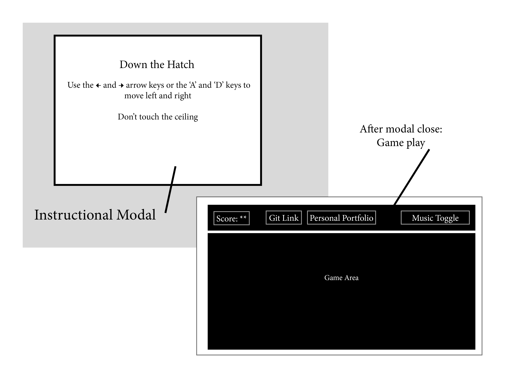

### Down the Hatch
[Live](matthew-moon.com/down-the-hatch)

#### Background

Down the Hatch is a Javascript recreation of the Texas Instruments graphing calculator classic, *Falldown* which itself is most likely an homage to *Fall Down 2600* by Atari.  The original Atari version features 2 whilst the graphic calculator version as well as this js version is for single player only.  

The goal is to simply move left or right and drop through a series of breaks that appear on rising platforms.  The speed and frequency of the rising walls increase over time.  Avoid hitting the ceiling for as long as possible.

#### MVP

- [ ] The game will open with an instructional modal, short and concise for those who know not the joy of literature.
- [ ] Use either &#8592;/&#8594; keys or `a`/`d` keys to play.
- [ ] Temporary high score show between rounds.
- [ ] Background music (off by default) with toggle.
- [ ] Production README when complete.

#### Wireframe

Clean modal on load with instructions and game title.  Three buttons across the top + scoreboard:
- Git Repo link
- Personal portfolio link
- Music toggle (default: off)

#### Build
- Pure JavaScript for logic.
- `HTML5 Canvas` with `Easel.js` for rendering.
- Webpack for bundle.

The project will be organized as such:
- `ball.js` for the object to control.
- `wall.js` for the generated obstacles.
- `game.js` will handle the logic of wall creation and ball movement.

#### Implementation Timeline
##### *Day 1*
This day will include all set-up and learning fundamentals.
- Stable Webpack.
- Render canvas.

#### *Day 2*
This day will continue with `Easel.js` and the movement of the ball as well as the logic behind the creation of the moving platforms.
- Ball object with movement.
- Create movint wall elements.

#### *Day 3*
Bring it all together.  Fine tune all of the pieces and make sure it runs properly.
- Fix bugs and any faulty logic.
- Style accordingly.
- Insert modal.

#### *Day 4*
Full style and functionality viable for launch, any remaining time attribute to bonus features.
- Full styling of modal and game.

#### *BONUS*
- Mobile friendly to allow touch.
- Advanced difficulty: leave behind a 'brick' path disallowing the option to go back once started in a particular direction.
- Allow wrap-around on platforms as toggle before game start, letting you leave from one end and enter the opposite.
